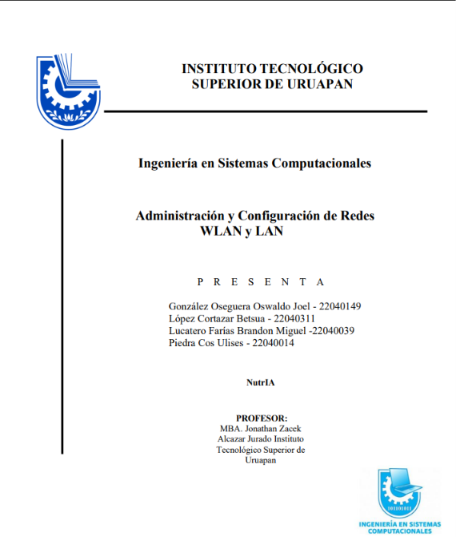
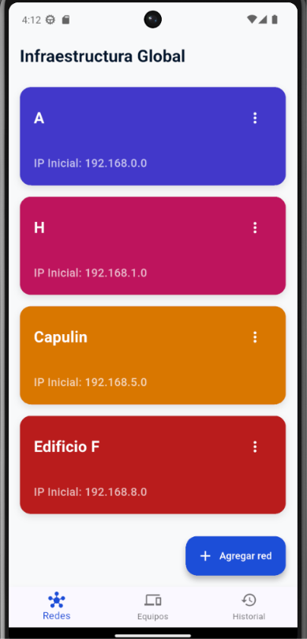
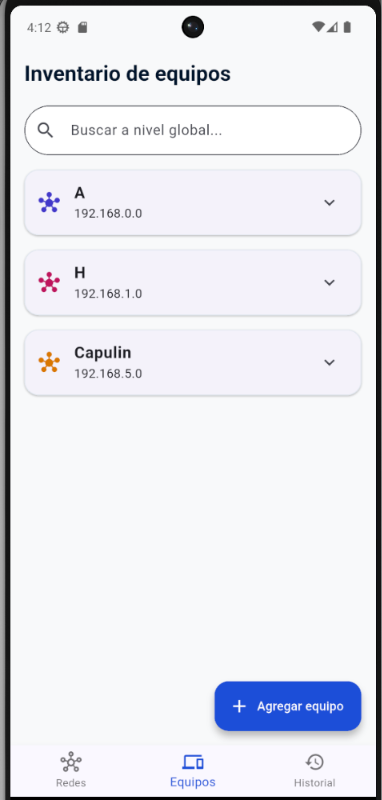
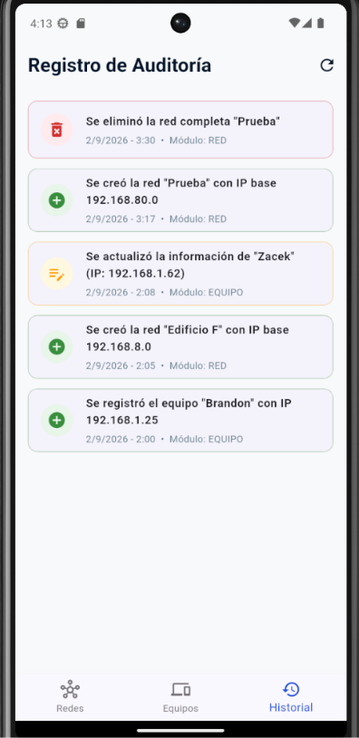
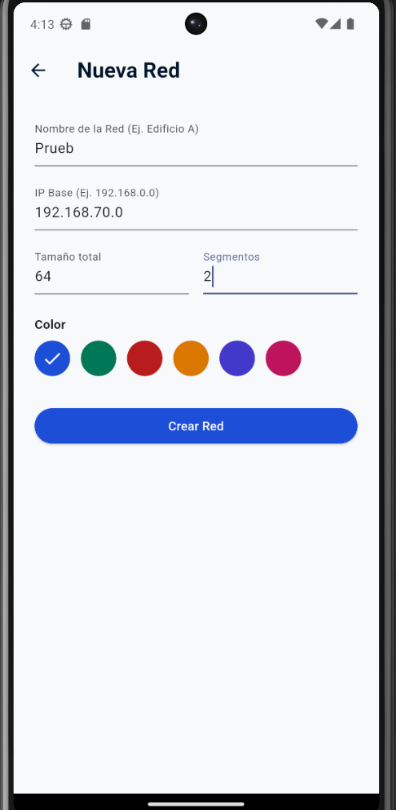
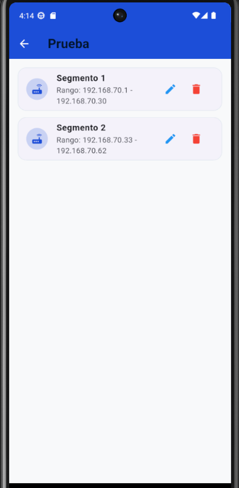
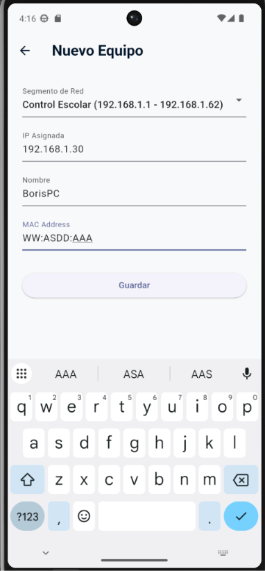
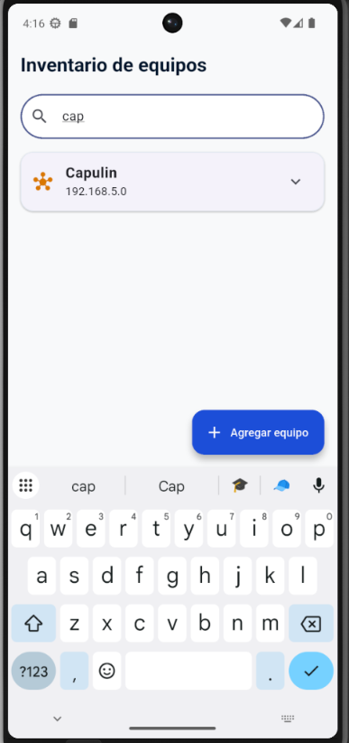
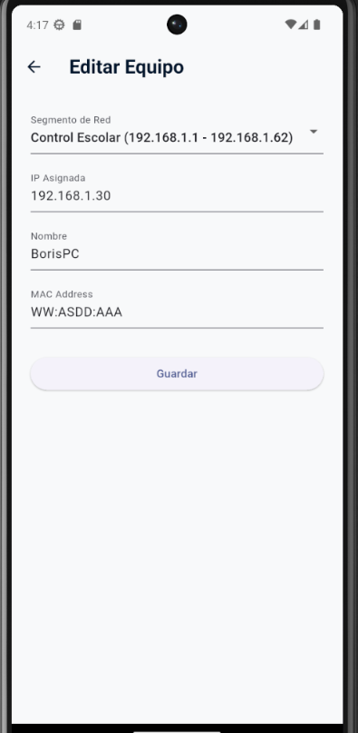
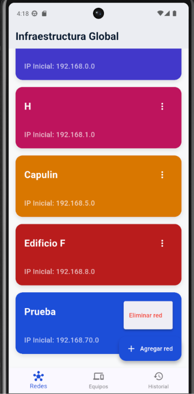

# INTRODUCCIÓN

En este documento se vera lo que es el desarrollo, la razón de haber creado una bitácora de redes, la guía de instalación, funcionamiento, justificación y capturas de pantalla que evidencien la existencia del programa.

# JUSTIFICACIÓN

El Instituto Tecnológico Superior de Uruapan cuenta con la tarea de administrar las redes en más de 5 edificios, dificultando la administración de la misma donde hasta el momento no se contaba con una aplicación para poder llevar acabo la tarea, con esta aplicación se busca facilitar la administración de la segmentación de redes y los equipos registrados dentro de la institución para el uso correcto de la red de la institución.

# GUÍA DE INSTALACIÓN Y EJECUCCIÓN
## REQUISITOS NECESARIOS
- Tener instalado Flutter SDK y Dart.
- Tener un IDE o editor de texto

Paso 1. Descargar o clonar el código del siguiente enlace:

**https://github.com/Oswii8411/Bit-cora**

Paso 2. Instalar dependencias con el siguiente comando en la terminal:

**flutter pub get**

Paso 3. Ejecutar la app:

**Flutter run**

# Capturas de funcionamiento

# EVIDENCIAS CRUD 

# INVENTARIO

# BUSCADOR 

# CONCLUSIONES

## Gonzáles Oseguera Oswaldo Joel
El desarrollo de esta aplicación representó una valiosa oportunidad para dominar tecnologías modernas. Flutter nos dio la versatilidad de abarcar múltiples plataformas sin duplicar código, y Supabase garantizó una persistencia de datos rápida y disponible. A nivel metodológico, la implementación de GitHub marcó un antes y un después en nuestra dinámica de trabajo, consolidando el uso de ramas y solicitudes de extracción para coordinar nuestro esfuerzo colectivo.

## López Cortazar Bet-Sua
Mi experiencia en este proyecto se centró en comprender cómo desacoplar la lógica de la aplicación respecto a la interfaz. Gracias al motor de Flutter logramos un rendimiento fluido en distintas plataformas, mientras que Supabase nos brindó una infraestructura confiable y accesible en todo momento. Trabajar con GitHub por primera vez como equipo transformó la forma en que nos organizamos, permitiéndonos integrar cambios de forma segura y constante.

## Lucatero Farias Brandon Miguel
Aprender el ecosistema de Flutter desde cero fue un reto importante, pero la curva de aprendizaje se facilitó al ver la reactividad de la aplicación en tiempo real. La conexión con Supabase como backend nos dio una solución rápida para la gestión de datos sin complicar la arquitectura. Además, la colaboración mediante GitHub nos enseñó la importancia del control de versiones, la resolución de conflictos y la distribución equitativa de las tareas.

## Piedra Cos Ulises
En la primera parte de la elaboración del proyecto utilizamos por primera vez almenos la mayor parte del equipo github donde descubrimos la facilidad que ofrece la herramienta para trabajar en equipo y poder desenvolvernos de mejor manera en el desarrollo de esta app en la cual se utilizo supa base para el funcionamiento de la app en cualquier momento. Se aprendió Flutter y el desarrollo multiplataforma 

## Rios Cervantes Zabdiel
Durante este desarrollo me enfoqué en la adaptación de la interfaz y la integración con Supabase. El uso de Flutter me demostró la eficiencia del desarrollo multiplataforma, ya que un solo bloque de código nos sirvió para mantener una experiencia homogénea en cualquier dispositivo. A la par, adoptar un flujo de trabajo basado en Git y GitHub fue indispensable para mantener el repositorio limpio y evitar la pérdida de avances durante las entregas del equipo.
